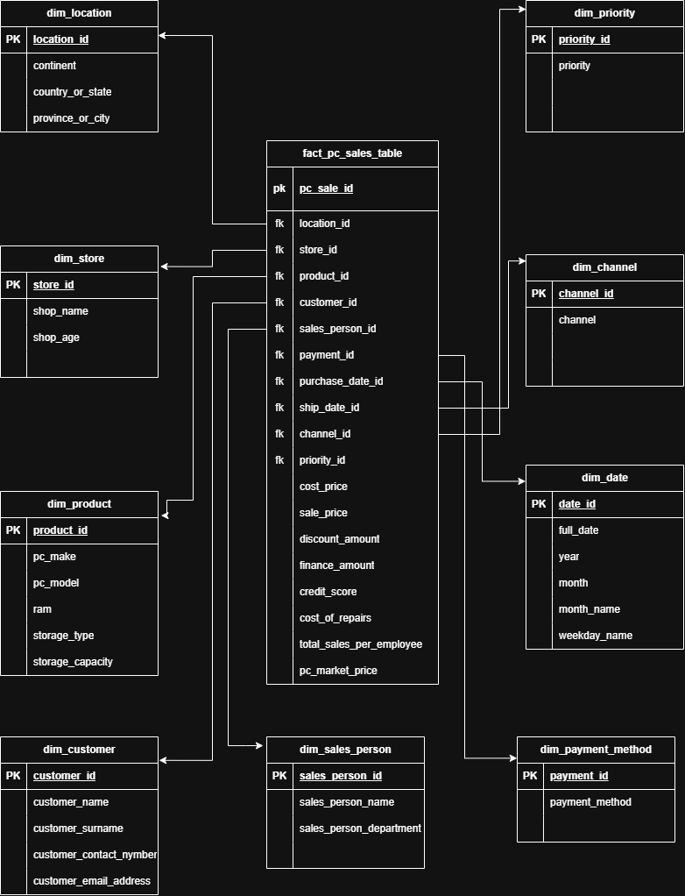

# 💻 PC Sales Data Engineering Project

🚀 A hands-on data engineering project focused on transforming raw PC sales data into a structured dimensional warehouse model for analytics and reporting.

---


## Project Summary

| Section        | Details                                                             |
| -------------- | ------------------------------------------------------------------- |
| Project Name   | PC Sales Data Engineering Project                                |
| Project Type   | Data Engineering & Dimensional Modelling Project                    |
| Main Goal      | Transform raw PC sales data into a structured analytical data model |
| Focus Areas    | Data Modelling, SQL Development, Data Warehousing, Staging Design   |


---

## 🎯 Business Problem 

PC sales businesses generate large amounts of transactional data from customers, products, employees, shipping activities, and financial transactions. Raw operational data is often difficult to analyze directly.

This project aims to:

* Organize raw PC sales data into structured dimensions and facts
* Improve data accessibility for analytics and reporting
* Create a foundation for scalable business solutions
* Enable easier analysis of sales performance, customer behavior, and product trends

---

## 📂 Dataset Description

The dataset contains information related to:
- 🌍 Geographic sales regions
- 👤 Customers
- 💻 PC products and specifications
- 🛒 Sales transactions
- 👨‍💼 Employees and departments
- 🚚 Shipping information
- 💰 Financial information
- 🔧 Repairs and pricing

---
## 🧩 Dimensional Modelling Design

The raw PC sales dataset was analyzed and grouped into business-oriented dimensions to support analytical reporting and warehouse design.

### 📂 Source Data Categories

| Category                   | Source Columns                                                                   |
| -------------------------- | -------------------------------------------------------------------------------- |
| 🌍 Location Data           | Continent, Country or State, Province or City                                    |
| 🏪 Shop Information        | Shop Name, Shop Age                                                              |
| 💻 Product Information     | PC Make, PC Model, Storage Type, Storage Capacity, RAM                           |
| 👤 Customer Information    | Customer Name, Customer Surname, Customer Contact Number, Customer Email Address |
| 👨‍💼 Employee Information | Sales Person Name, Sales Person Department                                       |
| 🛒 Sales Information       | Payment Method, Purchase Date, Ship Date, Channel, Priority                      |

---

### 🏗️ Dimensions Created

| Dimension Table      | Purpose                               |
| -------------------- | ------------------------------------- |
| `dim_location`       | Stores geographic sales information   |
| `dim_store`          | Stores shop-related information       |
| `dim_product`        | Stores PC product specifications      |
| `dim_customer`       | Stores customer information           |
| `dim_sales_person`   | Stores employee sales information     |
| `dim_payment_method` | Stores payment transaction methods    |
| `dim_date`           | Supports time-based analytics         |
| `dim_channel`        | Stores sales channel information      |
| `dim_priority`       | Stores sales priority classifications |


---
## 🔄 Project Workflow

### 1. 📥 Raw Data Preparation

The project started with raw PC sales data stored in Excel.

---

### 2. 📊 Excel Data Modelling

The dataset was grouped into categories using color-coded sections to organize related fields.

The workbook currently contains:

* Raw Data Sheet
* Data Modelling Sheet
* Dimension Tables Sheet
* Fact Table Planning Sheet

---

### 3. 🧩 Dimension Design

Dimension structures were designed and mapped visually using Draw.io.

The dimensional design helps organize business entities into structured analytical components.

---

### 4. 🗄️ SQL Staging Layer

SQL staging tables were created to define table structures and support future transformations.

This includes:

* Table creation scripts
* Insert scripts
* Structured dimension table setup

---

### 5. ⚙️ Stored Procedures

Stored procedures were created for each dimension table to automate loading and management processes.

---

### 6. ✅ Data Validation Scripts

Additional scripts were created to retrieve and validate dimension table data.

---

## 🧩 Project Visuals

### 📌 Dimensional Model Diagram



---

### 📊 Excel Data Modelling


---

### 🗄️ SQL Development


---
---

## 📌 Current Project Status

| Status      | Tasks                                                 |
| ----------- | ----------------------------------------------------- |
| Completed   | Excel data modelling and categorization               |
| Completed   | Dimension identification and grouping                 |
| Completed   | Draw.io dimensional diagrams                          |
| Completed   | SQL staging table creation                            |
| Completed   | Insert scripts for dimension tables                   |
| Completed   | SQL scripts for viewing dimension tables              |
| Completed   | Stored procedures for dimension tables                |
| In Progress | Fact table development                                |
| In Progress | Relationship integration between dimensions and facts |
| Planned     | ETL pipeline implementation                           |
| Planned     | Data quality validation checks                        |
| Planned     | Advanced SQL transformations                          |
| Planned     | Performance optimization                              |

---
## 🏆 Key Achievements

- ✅ Designed a dimensional warehouse structure
- ✅ Built SQL staging tables for structured transformations
- ✅ Developed reusable stored procedures for dimension management
- ✅ Organized raw transactional data into analytical dimensions
- ✅ Created scalable foundations for future ETL workflows
---

## 🛠️ Technologies Used

| 🚀 Technology                 | 📌 Purpose                                | 💡 Contribution to Project                                  |
| ----------------------------- | ----------------------------------------- | ----------------------------------------------------------- |
| 📊 **Excel**                  | Initial data modelling and categorization | Organized raw data into structured business categories      |
| 🎨 **Draw.io**                | Designing dimensional diagrams            | Created visual dimensional models for warehouse planning    |
| 🗄️ **SQL**                   | Database creation and transformations     | Built staging tables, insert scripts, and stored procedures |
| 🔧 **Git**                    | Version control                           | Managed project changes and tracked development progress    |
| 🌐 **GitHub**                 | Project hosting and documentation         | Showcased project structure and maintained documentation    |

---

### ⚡ Core Skills Demonstrated

| 🔥 Skill Area            | 📖 Description                                  |
| ------------------------ | ----------------------------------------------- |
| 🧩 Dimensional Modelling | Designing analytical warehouse structures       |
| 🗄️ SQL Development      | Creating tables, queries, and stored procedures |
| 🔄 Data Structuring      | Organizing raw data into analytical formats     |
| ⚙️ Staging Design        | Building staging layers for transformations     |
| 📊 Data Preparation      | Preparing datasets for analytics and reporting  |
| 🔧 Version Control       | Managing project updates using Git and GitHub   |


---

## 🚀 Future Roadmap

| 🎯 Phase       | 🔥 Goal                           | 📌 Planned Improvement                           | 🌟 Expected Impact                                |
| -------------- | --------------------------------- | ------------------------------------------------ | ------------------------------------------------- |
| 🟢 Short-Term  | Build Analytical Foundation       | 🏗️ Develop the `fact_sales` table               | Create the core transactional layer for analytics |
| 🟢 Short-Term  | Strengthen Data Relationships     | 🔗 Connect dimensions to fact tables             | Enable efficient analytical querying              |
| 🟢 Short-Term  | Improve Data Integrity            | 🔐 Implement foreign keys                        | Ensure relational consistency across tables       |
| 🟢 Short-Term  | Enhance Data Reliability          | ✅ Improve validation processes                   | Reduce inconsistencies and improve data quality   |
| 🟡 Medium-Term | Automate Data Processing          | ⚙️ Build ETL workflows                           | Streamline transformation and loading processes   |
| 🟡 Medium-Term | Increase Efficiency               | 🔄 Automate data loading pipelines               | Reduce manual processing effort                   |
| 🟡 Medium-Term | Improve Data Quality              | 🧹 Add automated quality checks                  | Detect and prevent bad data entries               |
| 🟡 Medium-Term | Expand Analytics Capability       | 📊 Create advanced analytical SQL queries        | Generate deeper business insights                 |
| 🔵 Long-Term   | Business Intelligence Integration | 📈 Integrate Power BI dashboards                 | Deliver interactive business reporting            |
| 🔵 Long-Term   | Optimize System Performance       | ⚡ Implement indexing and optimization strategies | Improve query speed and scalability               |

---
## 🌍 Future Vision

```text
Raw Data → Structured Warehouse → Automated Pipelines
        → Business Intelligence → Scalable Data Platform
```

---
## 📌 Final Note

🚧 This project is actively evolving as part of a hands-on data engineering and dimensional modelling journey.

Upcoming enhancements include:

* 🔗 Fact table integration
* ⚙️ Automated ETL pipelines
* 📊 Business intelligence dashboards
* ☁️ Cloud-based data engineering workflows
* ⚡ Query optimization and performance tuning

---

⭐ If you found this project interesting, feel free to explore the repository and follow the project journey.


